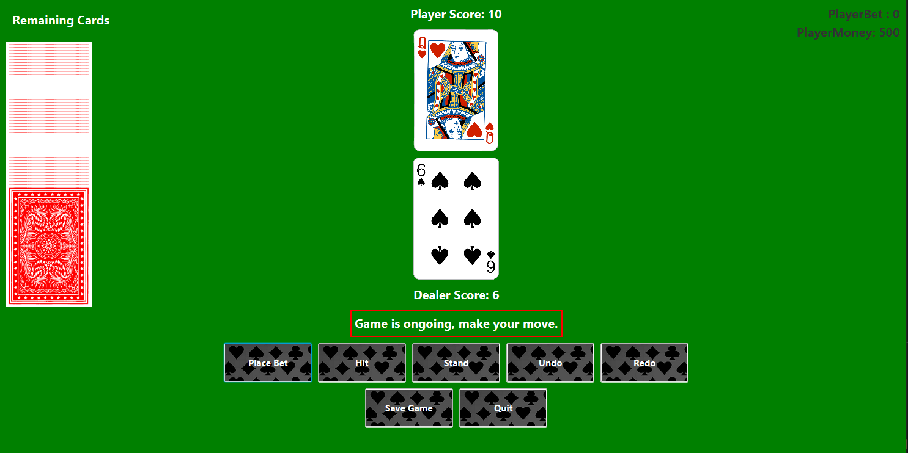

Test Status

## Coverage 

Coverage Status 

for checking locally use ./runCoverage in root 

## sbt project compiled with Scala 3

### Installation

This is a normal sbt project. You can compile code with `sbt compile`, run it with `sbt run`, and `sbt console` will start a Scala 3 REPL.

## How to play

### The red box is your Genereal information.

### Hit:
    you get a card when you press hit carefull!! (you can even hit on 21 and lose instantly)

### Stand

Dealer is drawing cards until the value of the hand is 17 or higher

You win if you have more Score than the Dealer 

You loose if you have less

Draw if your even 

### Betting

You can only place bets before pressing hit

you get your bet x2 when you win and lose your bet when you lose , draw you get your bet back

The reamaining cards are displayed on the left 

## Development

